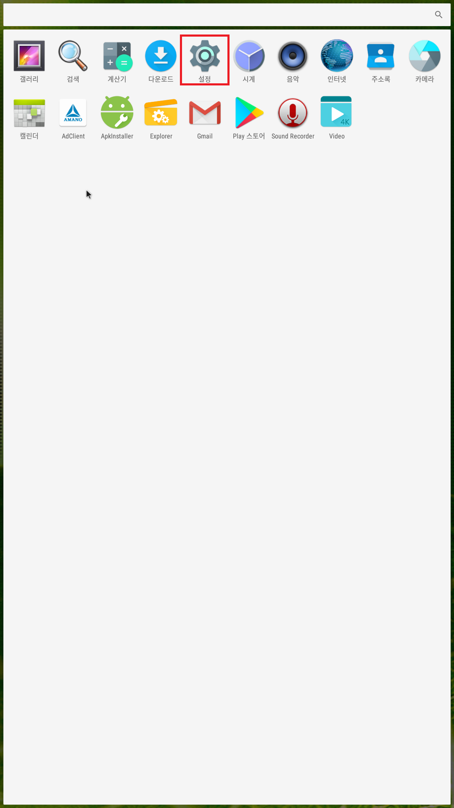
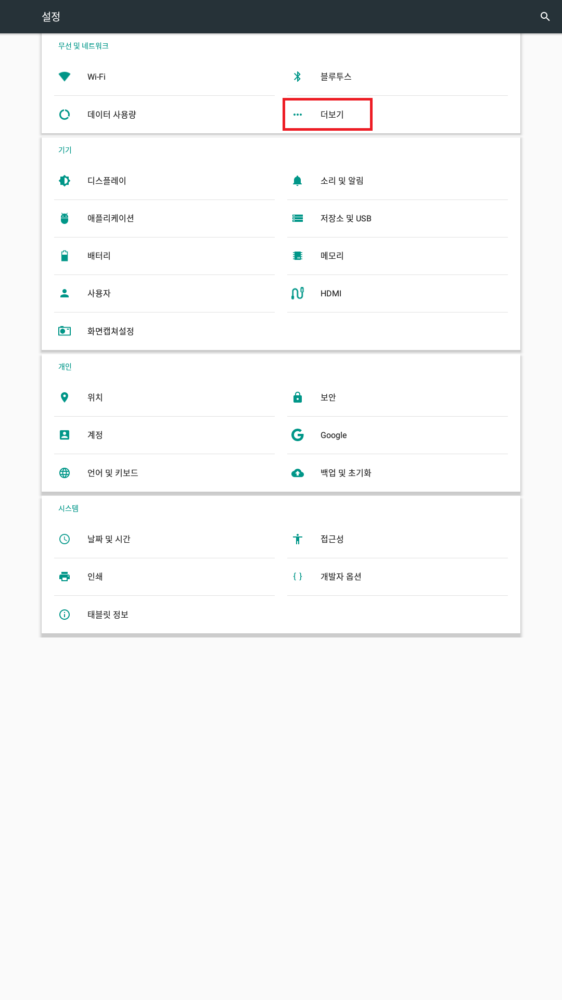
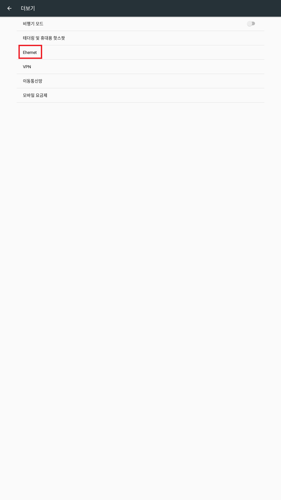
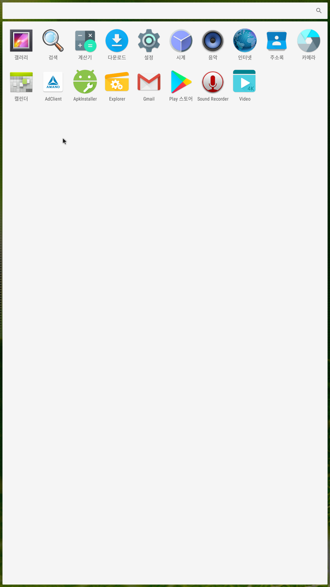

[처음으로](../readme.md) / [SK직영시스템 설치 매뉴얼](../install_manual.md) / [안드로이드 IP 설정]()
> 안드로이드 보드 설정 시 터치 스크린은 작동하지 않으므로 USB 키보드와 USB 마우스를 연결하여 작업합니다.
>

 

# 안드로이드 IP 설정

메뉴 아이콘을 선택 합니다.

 

설정 버튼을 누릅니다.

 

더보기 버튼을 누릅니다.

 

Ehernet 버튼을 누릅니다.

 

할당할 네트워크 정보를 IP adress, netmask, gateway, dns1, dns2에 기입 후 Ethernet Ip mode를 static 으로 합니다.

 

인터넷을 실행하여 웹 사이트에 정상 접속 되는지 확인합니다.

 

# 안드로이드 광고형 LPR 프로그램 다운

